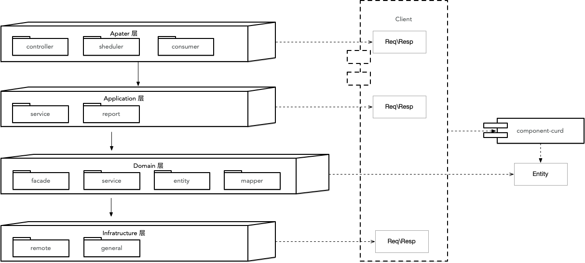

# EULA
EULA 是 Easy Use and Layered Architecture 的缩写，代表 “易用的分层架构”。

为什么易用？
- 提供了通用的 `CURD` 功能和 Restful 风格的接口，并实现了了 `Dto -> Entity` 的数据转换操作，开发人员可以更关注于业务处理
- 通过注解无侵入式统一数据格式
- 通过注解实现数据安全


## EULA 概述


### 包结构功能描述
| 层次             | 包名         | 功能                             | 必须 |
|----------------|------------|--------------------------------|----|
| adapter        | controller | 处理页面请求的 `controller`           | 否  |
| adapter        | scheduler  | 处理定时任务                         | 否  |
| adapter        | consumer   | 消费外部消息                         | 否  |
| application    | service    | 处理通用的 CURD 请求                  | 是  |
| domain         | entity     | 领域实体，同时可以作为用于持久化的实体            | 是  |
| domain         | service    | 领域服务，当存在需要多领域写协作时，更推荐在此实现      | 否  |
| domain         | mapper     | 数据持久化，相比放置在 `infra` 层减少了很多额外操作 | 否  |
| domain         | facade     | 上下文映射适配层，当调用外部请求时推荐通过在此进行适配    | 否  |
| infrastructure | remote     | 处理外部请求，建议通过 `domain` 层进行适配     | 否  |
| infrastructure | general    | 用于存放通用的配置类和工具类等                | 是  |
| client         | dto        | 服务对外的 DTO                      | 是  |

### 默认集成的外部组件
| 组件名称         | 功能                              |
|--------------|---------------------------------|
| mybatis-plus | ORM                             |
| hutool       | 小而全的 Java 工具类库                  | 
| lombok       | Java 实用工具，用来帮助开发人员消除 Java 的冗长代码 |
| flyway       | 数据迁移工具                          |

## EULA 组件
| 组件名称             | 功能                                | 依赖                        |
|------------------|-----------------------------------|---------------------------|
| component-dto    | 定义了 DTO 接口类以及分页请求体                | 无                         |
| component-curd   | 实现数据转换以及通用 CURD 功能和 Restful 风格的接口 | mybatis-plus、compoent-dto |
| component-result | 实现了无侵入式数据格式统一以及错误码管理              | mybatis-plus              |
| component-openai | 实现了 api2d（openai 国内代理）的 SDK       | 无                         |


## 如何使用 EULA
**1. 安装 eula archetype**

下载 `archetypes` 下的源码到本地，然后本地运行 `mvn install` 进行安装。

**2. 安装 eula components**

下载 `components` 下的源码到本地，然后本地运行 `mvn install` 进行安装。

**3. 创建应用**
```mvn
mvn archetype:generate  \
  -DgroupId=com.eula.demo \
  -DartifactId=demo \
  -Dversion=1.0.0-SNAPSHOT \
  -Dpackage=com.eula.demo \
  -DarchetypeArtifactId=archetype-layered \
  -DarchetypeGroupId=com.eula \
  -DarchetypeVersion=1.0.0-SNAPSHOT
```